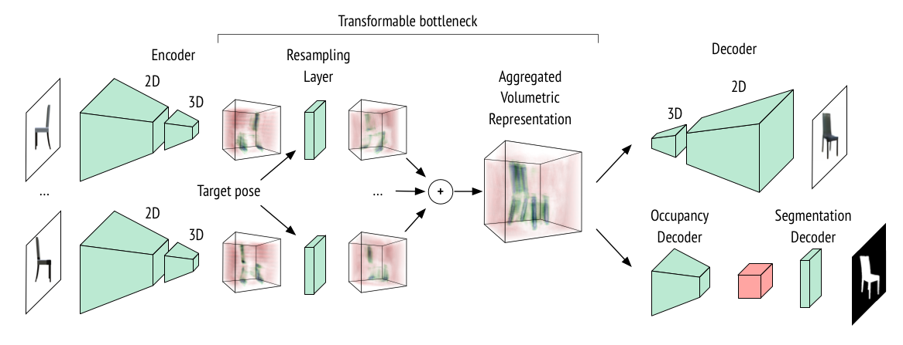
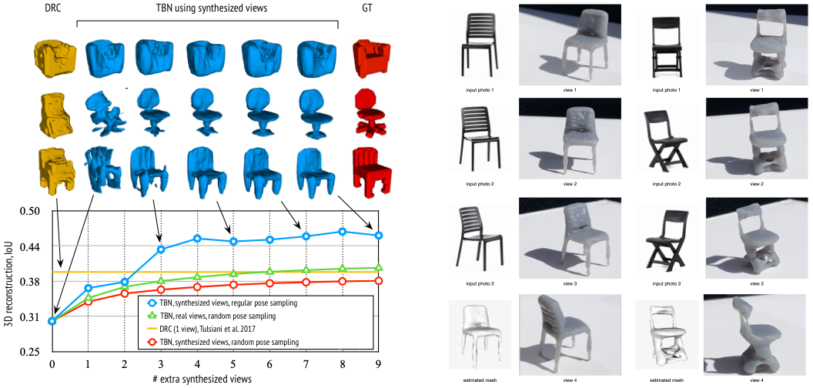

# Transformable Bottleneck Networks

This repository contains the source code for the paper [Transformable Bottleneck Networks](https://arxiv.org/abs/1904.06458) (TBNs) by [Kyle Olszewski](http://kyleolszewski.com), [Sergey Tulyakov](http://stulyakov.com), Oliver Woodford, [Hao Li](http://hao-li.com), and [Linjie Luo](http://linjieluo.com). Without any 3D supervision, TBNs learn spatially disentangled 3D bottlenecks.  TBNs achieve state-of-the-art performance on novel view synthesis and 3D reconstruction. The learnt spatial bottlenecks can be manipulated with arbitrary non-linear transformations allowing the user to perform creative object manipulations. Also check out the project [website](http://kyleolszewski.com/TB-Networks/).

## TBN Architecture

TBN architecture consists of three parts: 2D-3D encoder followed by a resampling layer, and a 3D-2D decoder network. The resampling layer transforms an encoded bottleneck to the targetview via trilinear interpolation. During training a TBN used 2D supervision only, including RGB images and foreground masks.



## Novel View Synthesis

TBNs can be efficiently trained on a variety of diverse objects. We show TBN generated novel views of chairs, cars, and humans. We note that TBNs can generate intermediate views of objects not seen during training. To perform novel view synthesis we simply rotate the transformable bottleneck and decode it.


## 3D Reconstruction

We trained a simple occupancy decoder applied on the transformable bottleneck. No 3D information was used during training, TBNs learn to reconstruct 3D structure of objects in the bottleneck using only 2D supervision. We then extract 3D meshes of objects represented using in the bottleneck. Given only a single input image a TBN can generate arbitrary number of novel views of this object and reuse them refining the predicted 3D shapes. We then use images of real objects to reconstruct their 3D shape and 3D print the predicted meshes.



## Creative and Interactive Manipulations

We apply various manipulations directly on the transformable bottlenecks and decode them to obtain images. We note that the manipulations applied on the bottleneck translate to the same manipulations in the image space. TBNs can then render such manipulated object under various novel views. We show vertical twisting, where the bottom part of the chair is rotated to the direction opposite to the top part of the chair. Horisontal stitching, where the seat of the chair is moved up and down making a regular chair look like a bar stool. Nonlinear inflation, where all the parts of chairs are inflated and deflated. We note that under all these creative manipulations the objects still look realistic.


We use our approach to rotate and deform objects before composing them into real images. The images are loaded into our application, from which a single aggregated bottleneck is computed. An interactive interface then allows the user to rotate, translate, scale and stretch the objects transforming and rendering the bottleneck in real-time. 

<p align="center">
  
</p>

## Instructions

This code was tested using Python 3.7.3, PyTorch 1.0.1 and CUDA 9.0. We recommend installing PyTorch using conda as described [here](https://pytorch.org/get-started). You will also need to install the following packages: scipy, configargparse, and tensorflow.

To run this code, download and extract the datasets below.

## Evaluation

You may evaluate the pre-trained models below by extracting them to models/ and running scripts/test_nvs_chair.sh and scripts/test_nvs_car.sh. --num_combine_views specifies how many input images are used.

## Training

See scripts/train_nvs_chair.sh and scripts/train_nvs_car.sh for examples of how to train our models. Running train_tbn.py with the --help parameter will provide a list of possible input parameters and their default values.

You can specify these parameter values either using the command line or by updating their values in train_config.ini during training or test_config.ini during evaluation.

## Models:

[NVS Cars](https://www.dropbox.com/s/mkmi6ya0w673ldv/nvs_car.pth?dl=0)

[NVS Chairs](https://www.dropbox.com/s/6147ael5apoljos/nvs_chair.pth?dl=0)

## Datasets

Novel view synthesis and creative manipulation dataset: [Chairs](https://www.dropbox.com/s/lc01fm5o8dbrp59/nvs_chair.zip?dl=0) [Cars](https://www.dropbox.com/s/b46nobbxcbul1d2/nvs_car.zip?dl=0)

3D Reconstruction Dataset: [Chairs](https://www.dropbox.com/s/82y78wyqo9xrba4/drc_chair.zip?dl=0) [Cars](https://www.dropbox.com/s/d6igpmapbsuxtad/drc_car.zip?dl=0) [Aeroplanes](https://www.dropbox.com/s/ppkig8xos1bo5an/drc_aero.zip?dl=0)

Extract these files to the directory specified by the --img_path parameter. The default directory is datasets/shapenet/

## Citation

If you find this useful, please cite the following:
```
@article{olszewski2019tbn,
   title={Transformable Bottleneck Networks},
   author={Olszewski, Kyle and Tulyakov, Sergey and Woodford, Oliver and Li, Hao and Luo, Linjie},
   journal={arXiv:1904.06458},
   year={2019}
}
